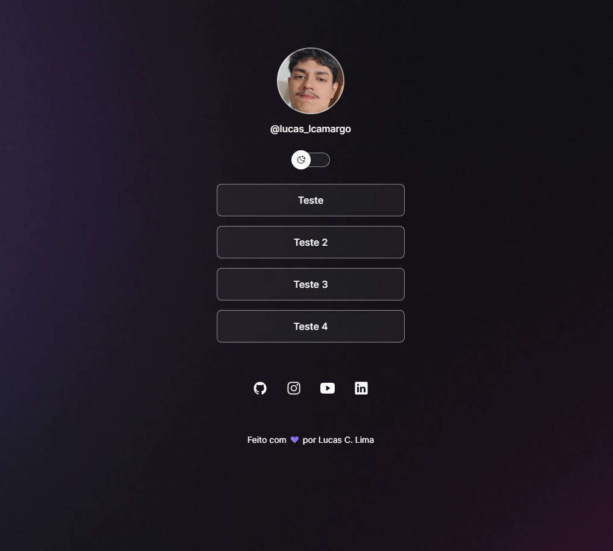

<h1 align="center">  Projeto Devlinks </h1>

Projeto realizado com o propósito de aprender o básico sobre as linguagens utilizadas na construção de sites. Criado pela Rocketseat, eu o utilizei apenas para fins educacionais.

  <a href="#-tecnologias">Tecnologias</a>&nbsp;&nbsp;&nbsp;|&nbsp;&nbsp;&nbsp;
  <a href="#-projeto">Projeto</a>&nbsp;&nbsp;&nbsp;|&nbsp;&nbsp;&nbsp;
  <a href="#-layout">Layout</a>&nbsp;&nbsp;&nbsp;|&nbsp;&nbsp;&nbsp;
  <a href="#memo-licença">Licença</a>

<!--

  

 -->

 

  

## 🚀 Tecnologias

Esse projeto foi desenvolvido com as seguintes tecnologias:

- HTML e CSS
- JavaScript
- Git e Github

## 💻 Projeto

A Página de Devlinks é um projeto que apresenta uma central de links de um desenvolvedor. No caso deste teste, trata-se dos meus próprios links.

## 🔖 Layout

Você pode visualizar o layout do projeto através [DESSE LINK](https://www.figma.com/design/QdWzLxGJ4mE6GjowG2vi0u/DevLinks-%E2%80%A2-Projeto-Discover-(Community)?node-id=58-415&t=ZnhKJeMOA4GSJiEE-0). É necessário ter conta no [Figma](https://figma.com) para acessá-lo.

## Licença

Esse projeto está sob a licença MIT.
-->
